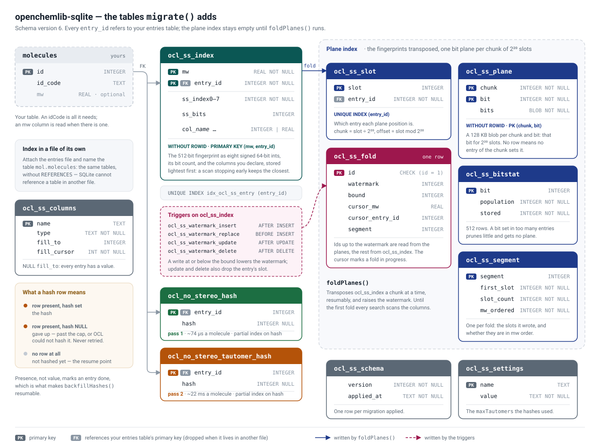

# openchemlib-sqlite

[](https://www.npmjs.com/package/openchemlib-sqlite)
[](https://github.com/cheminfo/openchemlib-sqlite/actions/workflows/nodejs.yml)

SQLite-backed molecular search using [OCL (openchemlib-js)](https://github.com/cheminfo/openchemlib-js).
Adds substructure, exact, tautomer-insensitive, and similarity search on top of an **existing** molecules table that you own.

## Requirements

- Node.js ≥ 22.5 (uses the built-in `node:sqlite` module)
- `openchemlib` peer dependency ≥ 9.20.1

## Installation

```sh
npm install openchemlib-sqlite openchemlib
```

## How it works

`openchemlib-sqlite` does **not** create or own a molecules table. It works alongside an existing table that contains at minimum:

- a primary key column (default: `id`)
- an `id_code` column holding the OCL idCode string (default column name: `id_code`)

Nothing else: the stereo- and tautomer-insensitive keys are this package's business, not yours — it computes and stores them itself (see [Structure hashes](#structure-hashes)).

`migrate()` creates an `ocl_ss_index` table storing the 512-bit fingerprint for each indexed entry, referencing the entries table by its primary key, the two structure-hash tables, plus an `ocl_ss_schema` table recording the schema version. Call it on every startup: it applies whatever a database is missing and upgrades one written by an older release in place — see [Upgrading](#upgrading).

## Setup

```js
import { DatabaseSync } from 'node:sqlite';
import * as OCL from 'openchemlib';
import { MoleculesDBSQLite } from 'openchemlib-sqlite';

const db = new DatabaseSync('molecules.db');

// Your molecules table (already exists, or create it here):
db.exec(`
  CREATE TABLE IF NOT EXISTS molecules (
    id      INTEGER PRIMARY KEY,
    id_code TEXT NOT NULL UNIQUE
  )
`);

// Point the library at it:
const molDB = new MoleculesDBSQLite(db, OCL, {
  entriesTable: 'molecules',
});
molDB.migrate(); // creates or upgrades ocl_ss_index (idempotent)
```

`MoleculesDBConfig` options:

| Option          | Default      | Description                                                                                                     |
| --------------- | ------------ | --------------------------------------------------------------------------------------------------------------- |
| `entriesTable`  | _(required)_ | Name of the existing molecules table                                                                            |
| `pkColumn`      | `'id'`       | Primary key column name                                                                                         |
| `idCodeColumn`  | `'id_code'`  | Column holding the OCL idCode                                                                                   |
| `mwColumn`      | `null`       | Column holding the molecular weight (REAL); enables automatic mass-difference sorting in substructure search    |
| `maxTautomers`  | `5000`       | Ceiling on tautomer enumeration; recorded in the database, and changing it rebuilds the tautomer hashes         |
| `trustMwColumn` | `false`      | Promise that `mwColumn` holds real molecular weights, so the prescreen may seek past entries too light to match |
| `batchSize`     | `1024`       | Candidates verified per call; measured 32.0 µs each at 64, 10.7 µs at 256, 8.2 µs at 1024                       |

## Tuning SQLite for a large database

The library is handed a connection it does not own, so it sets no pragmas. Two
are worth setting yourself once the index is large.

```js
const db = new DatabaseSync('molecules.db');
// Read index pages straight out of the page cache instead of copying them into
// SQLite's own. Measured on a 2 M-entry prescreen: 124 ms -> 64 ms. Node's
// build caps the value at 2 GB, and asking for more is not an error.
db.exec('PRAGMA mmap_size = 2147483648');
// node:sqlite ships SQLite's stock 2 MB page cache. 128 MB (the value is in
// KiB, negative) is a better fit for a scan-heavy workload.
db.exec('PRAGMA cache_size = -131072');
```

A prescreen reads the `ocl_ss_index` covering index end to end, so it is paging
work more than it is CPU work, and both pragmas address exactly that. Neither
changes any result.

## Inserting molecules

Insert into your own table first, then index the molecule via `molDB.insert(entryId, molecule)`.

### Parsing molecules — auto-detect format

`OCL.Molecule.fromText(text)` detects the format automatically:

- string containing `V2000` or `V3000` → parsed as molfile
- otherwise tries SMILES first, then idCode

```js
const mol = OCL.Molecule.fromText(unknownFormatString);
if (!mol) throw new Error(`Could not parse: ${unknownFormatString}`);
```

### Full insert example

```js
const mol = OCL.Molecule.fromText('Cn1c(=O)c2c(ncn2C)n(C)c1=O'); // auto-detects SMILES
if (!mol) throw new Error('Could not parse molecule');

const idCode = mol.getIDCode();

const { lastInsertRowid } = db
  .prepare('INSERT INTO molecules (id_code) VALUES (?)')
  .run(idCode);

// Index the molecule — pass the Molecule instance or an idCode string
molDB.insert(Number(lastInsertRowid), mol);
```

Passing a `Molecule` instance to `insert()` avoids a redundant re-parse. Passing an idCode string is also valid:

```js
molDB.insert(Number(lastInsertRowid), idCode);
```

### Giving `insert()` what you already computed

A caller that stores its own fingerprints has already paid for the expensive
part, and `insert()` takes it rather than building it again:

```js
import { getIndex } from 'openchemlib-search-wasm';

molDB.insert(entryId, idCode, { index: getIndex(idCode), mw: 194.19 });
```

With both given nothing here reads the molecule, so `insert()` does no chemistry
at all. Measured over real idcodes: **1350 µs an entry building the fingerprint,
88 µs writing one already in hand** — at 150 million entries, 56 hours against
under four. `index` is the 512-bit FragFp in whichever width you hold it, 16
words of 32 bits or 8 of 64.

The statement it writes with is prepared once per instance: preparing it for
every insert was most of what writing a precomputed entry cost, 14.9 µs an
entry against 3.7 µs once prepared
([benchmark/insertPrecomputed.mjs](benchmark/insertPrecomputed.mjs)).

A `mw` must be the value `mwColumn` holds when one is configured, or the index's
clustered order stops matching what a bulk path would have written.

## Keeping the index in its own database

The index does not have to live beside the entries it indexes. Open the index
file, attach the entries file, and name the table through the attachment:

```js
const index = new DatabaseSync('index.sqlite');
index.exec(`ATTACH DATABASE 'entries.sqlite' AS mol`);

const molDB = new MoleculesDBSQLite(index, OCL, {
  entriesTable: 'mol.molecules',
  mwColumn: 'mw',
});
molDB.migrate(); // every ocl_* table is created in index.sqlite
```

Everything works across the attachment — `insert()`, every search mode, and
`backfillHashes()`. The entries database is never written to, so it can be a
read-only replica, and the index can be deleted and rebuilt, or built on another
machine and copied in, without touching it.

**The one difference is the foreign key.** SQLite has no syntax for a qualified
parent table — `REFERENCES mol.molecules(id)` is a parse error — and a foreign
key may not span databases at all, so a qualified `entriesTable` builds the same
tables without the constraint. Only the constraint is dropped, never a column, so
the same queries and the same migrations run against a database built either way.
What is lost is SQLite refusing to index an entry that does not exist, and
refusing to delete an entry that is still indexed.

## Searching

All search modes return a `SearchResponse` with `results`, `total`, and optional `partial` / `screened` fields;
the scans add `timedOut`, and a substructure scan stopped early adds `resume` (see [Pagination](#pagination)).
Each result contains `{ entryId, idCode }` — use `entryId` to look up additional data in your own table.

The query can be a string (parsed with `options.format`) or a `Molecule` instance (format option is ignored).
The library sets the fragment flag automatically: `false` for `exact` / `exactNoStereo` / `similarity`,
`true` for `substructure`. If the flag needs to change on a passed-in instance, a compact copy is made so the
original is never mutated.

### Exact match

```js
const { results } = molDB.search('Cn1c(=O)c2c(ncn2C)n(C)c1=O', {
  mode: 'exact',
  format: 'smiles',
});

// Passing a Molecule instance directly:
const { results } = molDB.search(
  OCL.Molecule.fromSmiles('Cn1c(=O)c2c(ncn2C)n(C)c1=O'),
  {
    mode: 'exact',
  },
);
```

### Exact match ignoring stereocenters

Requires the hashes to have been built — see [Structure hashes](#structure-hashes).

```js
const { results } = molDB.search('NC(C)C(=O)O', {
  mode: 'exactNoStereo',
  format: 'smiles',
});
// returns both L-alanine and D-alanine
```

### Exact match ignoring stereocenters and tautomerism

Requires the hashes to have been built — see [Structure hashes](#structure-hashes).

```js
const { results } = molDB.search('CC(=O)CC(=O)C', {
  mode: 'exactNoStereoTautomer',
  format: 'smiles',
});
// finds pentane-2,4-dione whether it was stored as the keto or the enol form
```

A compound keys the same whether it was drawn as the keto or the enol form and
whether or not its stereo centres were assigned, so this is the mode to use when
"the same molecule" means the same constitution rather than the same drawing.

An entry whose hash could not be computed — see the cap below — has NULL stored
and is never returned by this mode. So is a query OCL cannot hash.

### Substructure search

```js
const { results, screened, partial } = molDB.search('c1ccccc1', {
  mode: 'substructure',
  format: 'smiles',
  timeoutMs: 10000,
});
```

A 512-bit fingerprint prefilter (bitwise AND) discards non-candidates before running the full OCL substructure check.
Only the 64-bit words the query sets bits in are tested, and a scan still
running after 30 ms, with 16 384 rows read, measures them on 2 048 rows sampled
across what it has left to read and tests the most selective first, so most
rows are rejected after one column read. The sample has 20 ms: on a cold index
its random reads would cost a short scan a second, so it is given up there and
tried again later.

On the first 10 M molecules of PubChem, a scan of the whole index costs, per
row read ([benchmark/prefilterGuard.mjs](benchmark/prefilterGuard.mjs)):

| fragment           | every word, guard first | measured order, guard after it |
| ------------------ | ----------------------- | ------------------------------ |
| benzene            | 331.0 ns                | 151.9 ns                       |
| quercetin          | 133.1 ns                | 110.8 ns                       |
| dibenzoselenophene | 184.7 ns                | 110.4 ns                       |
| steroid            | 151.4 ns                | 109.2 ns                       |

and the guard still stops a scan within 1–4 ms of its deadline.

**`timeoutMs` is enforced from inside SQLite.** A scan whose rows all fail the
prefilter or the candidates test yields nothing, so the loop that reads the clock
between rows never runs. On a driver that can register a SQL function, the library
registers `ocl_ss_deadline` on the connection and puts it among the scan's
conditions, so the statement itself stops at the deadline. It sits first until
the scan has measured its rows, then right after the most selective word, where
it sees only the rows that word lets through and reads the clock on a
correspondingly larger share of them — about once per 1 024 rows read either
way — instead of costing every row a column read. A `membership` subquery is
guarded on the rows it lists, so listing a large one stops on time too, as long
as it keeps producing rows; one that reads many rows to produce few cannot be
interrupted before it ends, because `node:sqlite` offers no progress handler.
`timedOut: true` then says the clock stopped the scan; `maxResults` and
`maxCandidates` set only `partial`. Without `function()` the clock is read
between rows, as before.

**Empty query optimization** — passing a molecule with no atoms (e.g. `new OCL.Molecule(0, 0)`) skips the fingerprint prefilter entirely and returns every indexed entry, because an empty fragment matches everything.

### Substructure search sorted by mass difference

When `mwColumn` is configured, substructure results are **automatically** ranked by ascending `|queryMw − resultMw|`. A molecule whose mass equals the query mass (an exact structural match) therefore appears first, with no extra option required:

```js
// Schema must include a molecular-weight column, e.g.:
//   mw REAL NOT NULL
// Construct MoleculesDBSQLite with mwColumn: 'mw' to enable automatic sorting.

const { results } = molDB.search('c1ccccc1', {
  mode: 'substructure',
  format: 'smiles',
});
// results[0] is the molecule whose mass is closest to benzene's MW (~78 Da).
// Each result carries a .mw field with the value from the database.
```

The molecular weight of the query is computed with `fragment = false` on a temporary copy so the original `Molecule` instance is never mutated.

### Similarity search (Tanimoto)

```js
const { results } = molDB.search('Cn1c(=O)c2c(ncn2C)n(C)c1=O', {
  mode: 'similarity',
  format: 'smiles',
  similarityThreshold: 0.4,
});
// results sorted by descending similarity, then by entry id; each entry has a .similarity field
```

A similarity search reads every entry, so the coefficient is computed inside
SQLite, by a function the library registers on the connection, and the
threshold is tested there: only the entries that reach it are handed to
JavaScript. Over 891 901 natural products at a threshold of 0.8, a scan takes
484 ms instead of 3 502 ms (543 against 3 926 ns an entry, flavone) and 401 ms
instead of 3 250 ms (quercetin) —
[benchmark/similarityScan.mjs](benchmark/similarityScan.mjs). A driver that
cannot register a function falls back to reading every row.

Every row also stores how many bits its fingerprint sets, `ss_bits`. The
coefficient is the bits both set over the bits either sets, so it never exceeds
the ratio of the two counts, and reaching a threshold `t` needs
`t·|q| ≤ |r| ≤ |q|/t`: a row outside that window is rejected by one comparison
before its coefficient is computed. On the first 1 M molecules of PubChem, a scan at 0.8
drops from 1 834 to 514 ns a row for quercetin and from 1 814 to 374 for
flavone; at 0.6, where more rows are in the window, from 2 077 to 1 129 and from
2 046 to 663 — [benchmark/similarityWindow.mjs](benchmark/similarityWindow.mjs).
A row whose count is not known is computed, so the answer never depends on it.

### Pagination

```js
const { results, total } = molDB.search(query, {
  mode: 'substructure',
  format: 'smiles',
  limit: 50,
  from: 0,
});
```

A substructure scan stopped by `maxResults` or by its time also says where it
stopped. `resume` is the weight and entry id of the last match it kept — or of
the last candidate it read, when its time ran out — and handing it back as
`after` starts the next scan there, sought on the clustered key, so a deep page
costs what the first one does. `resume` is absent once the scan has read every
candidate, and `timedOut` says whether the clock stopped it.

A scan bounded by `maxResults` that the [plane index](#folding-the-plane-index)
finished reads it in the same `(mw, entry_id)` order, so its `resume` is the same
too. Only an unbounded scan the planes answer outright reads them in slot order;
when its time runs out there is no position to give, `resume` is absent and
`partial` says the answer is incomplete. A scan given `candidates` never takes
the plane path.

```js
let after;
do {
  const page = await molDB.search('c1ccccc1', {
    mode: 'substructure',
    maxResults: 50,
    ...(after === undefined ? {} : { after }),
  });
  show(page.results);
  after = page.resume;
} while (after !== undefined);
```

### Restricting a search to candidates

A scan's cost is dominated by parsing and matching each candidate molecule, so
when the caller already knows which entries are relevant — from an attribute
filter, an earlier query, anything expressible in SQL — hand that over as a
subquery instead of filtering the results afterwards, which pays for the full
scan first:

```js
const { results, total } = await molDB.search('c1ccccc1', {
  mode: 'substructure',
  format: 'smiles',
  candidates: {
    sql: 'SELECT id AS entry_id FROM ligands WHERE name LIKE :name',
    params: { name: '%acetate%' },
  },
});
```

What you stop paying for is the candidates that are never verified, so the gain
is proportional and grows with the table size. Measured on 50 000 CCD ligands
(8 cores), restricting a phenazine scan to the 9 232 entries matching that
filter: **199 ms → 50 ms**.

`sql` must select exactly one column, named `entry_id`, and `params` must use
**named** parameters (`:name`) since the prescreen binds its own anonymous ones.
Every mode honours it (`substructure`, `similarity`, `exact`, `exactNoStereo`,
`exactNoStereoTautomer`). It belongs to the single prescreen statement, so it is
evaluated by one search however many verifier threads are running.

#### How the subquery is applied: `strategy`

```js
candidates: {
  sql: 'SELECT id AS entry_id FROM ligands WHERE band = :band',
  params: { band: 7 },
  strategy: 'probe', // 'membership' (default) | 'probe' | 'drive'
},
```

| `strategy`             | what it does                                                                                            | right when                                                     |
| ---------------------- | ------------------------------------------------------------------------------------------------------- | -------------------------------------------------------------- |
| `membership` (default) | runs the subquery once, holds its ids, tests each entry of the weight-ordered scan against them         | the subquery is modest and an index answers it                 |
| `probe`                | looks each entry the prefilter keeps up in the subquery, as a correlated `EXISTS`; nothing is listed    | the subquery keeps a large share, or tests an unindexed column |
| `drive`                | reads the subquery's entries first, each fingerprint through the `entry_id` index, then sorts by weight | the subquery returns few rows                                  |

A membership list costs the whole subquery before the first candidate is read; a
probe costs the page, since the scan stops as soon as it has enough; drive costs
the subquery's own rows, however large the index. Measured on 4 023 045 entries,
benzene, a page of 24: `band = 7` (1%, no index) takes 107 ms as membership and
11 ms as a probe; `tag = 7` (0.01%, indexed) takes 115 ms as membership and
3.7 ms driven ([benchmark/filteredScan.mjs](benchmark/README.md#filters-filteredscanmjs)).
A probe's subquery should be a plain SELECT — joins and WHERE — so SQLite can push
the entry id into it.

The exact modes read a handful of rows, so they always test the subquery per row,
whatever the strategy. A similarity scan follows it: `probe` tests per row, the
other two join the subquery.

#### Bounding the weight: `mwRange`

```js
const { results } = await molDB.search('c1ccccc1', {
  mode: 'substructure',
  mwRange: { min: 260, max: 500 }, // inclusive; either bound may be left out
});
```

The index is clustered by weight, so a bound here is a **seek**: the scan starts
at `min` and ends at `max` without reading what lies outside. The same bound
written into `candidates` is tested entry by entry, or listed in full as
membership: on the benchmark above, `mw >= 260 AND band < 80` takes 497 ms as a
membership list and 3.6 ms as `mwRange: { min: 260 }` plus a `band < 80` probe. The
values are compared with the weight the index stores — the one `insert()`
derived, or your `mwColumn` / precomputed `mw`. Every mode honours it; outside
the substructure scan it is a test rather than a seek.

#### Bounding a property the index carries: `columns` and `columnRanges`

A property the index does not hold is a subquery, probed per candidate in your
tables. Declare the few properties you filter on most and the index carries
them in every row, so a bound on one is a comparison on the row the scan is
already reading:

```js
const molDB = new MoleculesDBSQLite(db, OCL, {
  entriesTable: 'molecules',
  columns: { rotatableBondCount: 'integer', logP: 'real' },
});
molDB.migrate();

molDB.insert(id, idCode, {
  index,
  mw,
  columns: { rotatableBondCount: 3, logP: 2.41 },
});

const page = await molDB.search('c1ccccc1', {
  mode: 'substructure',
  mwRange: { min: 610 },
  columnRanges: { rotatableBondCount: { max: 4 }, logP: { max: 3 } },
  maxResults: 24,
});
```

The bounds are inclusive and honoured by every mode, on the column path and on
the planes alike. A column costs a byte or two per entry for a small integer
and nine bytes for a real, and every instance writing one index must declare
the same columns: one that declares fewer writes NULL in the others, which no
bound keeps. Naming in `columnRanges` a column the index does not carry for
every entry throws.

On the first 10 M molecules of PubChem, every heavy benzene candidate (410 805,
`mw ≥ 610`) tested against a bound costs 1.61 µs probed in the entries table
(with its formulas joined, as molecules.cheminfo.org did), 1.43 µs probed
alone, and **0.18 µs as a carried column**; a first page of 24 with 6 verifier
threads ([benchmark/carriedColumns.mjs](benchmark/carriedColumns.mjs)):

| bounds                   | candidates | probed   | carried |
| ------------------------ | ---------- | -------- | ------- |
| rotatable ≤ 4            | 20 623     | 11.1 ms  | 8.1 ms  |
| rotatable ≤ 2, logP ≤ 3  | 1 155      | 42.2 ms  | 11.6 ms |
| rotatable ≤ 1, logP ≤ −2 | 187        | 246.6 ms | 43.0 ms |

The last is the one that grows with the index: a filter rarer than a page reads
every candidate, at 0.18 µs instead of 1.6 µs each. The eight columns
molecules.cheminfo.org carries — six small counts, logP and the polar surface
area — added 31 bytes an entry to `ocl_ss_index` (1.01 → 1.32 GB at 10 M) and
6% to the build (44.3 → 46.9 µs an entry).

**Declaring a column on an index that already holds entries** adds it at once
— a change to the schema alone, no row is rewritten — and empty for every one
of them. `columnStatus()` says so (`complete: false`, with how far it has been
filled), and a bound on it throws until `fillColumns()` has given every entry
its value:

```js
const status = molDB.columnStatus();
// [{ name: 'logP', type: 'real', declared: true, complete: false, filledThrough: 0, fillTo: 14878852 }, …]

await molDB.fillColumns(
  (entryIds) =>
    readMyTable(entryIds).map((row) => ({
      entryId: row.id,
      columns: { rotatableBondCount: row.rot, logP: row.logP },
    })),
  { onProgress: (filled) => logger.info({ filled }, 'carried columns') },
);
```

It walks the entries in id order through the entry index, a chunk of 5 000 per
short transaction with its progress committed alongside, yields between
chunks, and resumes where it stopped. A column is never dropped or retyped:
one no longer declared stays in the file but is neither written nor bounded,
and one declared with another type is refused.

## How a substructure search runs

A substructure search is two steps, and they cost very different amounts:

| step      | what it does                                                                                | share of the time |
| --------- | ------------------------------------------------------------------------------------------- | ----------------- |
| prescreen | one SQL scan of `ocl_ss_index`, keeping rows whose fingerprint is a superset of the query's | ~3%               |
| verify    | parse each surviving candidate and run the graph match                                      | ~97%              |

So the prescreen is left alone: a single query, on the calling thread's
connection, streamed. Only the verification is spread over `poolSize` threads,
which receive the fragment once and then answer batches of idCodes with
match / no-match. They hold no database connection.

Two properties fall out of that:

- **It self-balances.** Batches go to whichever thread is free, so the split
  never depends on guessing how candidates are distributed. On 50 000 CCD
  ligands a full phenazine scan goes 710 ms → 199 ms (1 → 8 threads).
- **Concurrent searches share the pool.** The verifiers are stateless and cache
  each fragment they see, so several searches interleave on the same threads
  instead of each monopolising them.

### Why the index is ordered by molecular weight

`ocl_ss_index` is `WITHOUT ROWID` with primary key `(mw, entry_id)`, so the table
is _physically_ stored lightest-first. Nothing ever has to sort it: scanning it
is already the right order, and the prescreen is a genuine row-by-row cursor
rather than a materialised result set. Two things follow.

**`maxResults` really stops the scan.** It is not a slice of a finished result:
the cursor is abandoned mid-table, so the candidates past it are never read, let
alone parsed. A benzene scan of 50 000 ligands whose prefilter admits 36 801
candidates reads only ~1 400 of them and returns in 16 ms instead of 787 ms.

**What survives an early stop is the smallest superstructures** — the matches
closest to the query — rather than an arbitrary insertion-order subset.

**A match cannot be lighter than the fragment**, and since the table is
physically ordered by weight, the prescreen can _seek_ past every entry too light
to be a superstructure rather than reading and rejecting them. It is the only
predicate in the prescreen SQLite can seek on; the fingerprint test is a bitmask
and has to be evaluated row by row.

The floor is a fragment's own `getMolecularFormula().relativeWeight`, which for a
fragment counts **only heavy atoms** — benzene reads `C6`, 72.07, not `C6H6`,
78.11 — so it is sound whatever hydrogens the match carries. It is dropped
entirely in three cases, each of which would otherwise lose real matches:

- the fragment carries any **query feature**: an atom list or a wildcard lets an
  atom match a lighter element than the formula assumed, and an exclude group
  puts atoms in the formula that a match must _not_ have;
- any entry's stored weight is **0**, which `insert()` also uses for "unknown";
- a **`mwColumn` is configured** and `trustMwColumn` is not set, because that
  column is yours and may hold a sort key rather than a weight.

This is why `candidates` uses `+s.entry_id IN (…)`. The unary `+` marks the term
unusable by an index, which keeps `ocl_ss_index` as the driving table. Without
it SQLite drives the scan off the subquery — the smaller side, and one with no
statistics — which throws the physical order away and needs a temp b-tree to
rebuild it, materialising every candidate before the first row comes out. Forcing
the clustered scan keeps a restricted search streaming and lightest-first exactly
like an unrestricted one (24 ms vs 70 ms on the benzene scan above).

## Folding the plane index

`molDB.foldPlanes()` transposes fingerprints into the plane index, and **nothing
calls it for you**. Until it runs, the index is empty and every search takes the
column scan exactly as before, so a database that never folds simply never gets
faster.

It is manual for the same reason `backfillHashes()` is: at ~38 µs an entry a
first fold of 150 M takes about 95 minutes. It is resumable — each chunk it
publishes records where it stopped, so the next call carries on from there — and
`planeStatus().pending` is the number to watch: entries no fold has reached,
which every search still screens the slower way.

```js
let result;
do {
  result = molDB.foldPlanes({ maxChunks: 1 });
} while (result.pending);
```

### Ids that only grow: the watermark

The planes are appended to and never rewritten, so they are trusted only up to a
**watermark**: the highest entry id the last fold covered. Every entry at or
below it is in the planes with its current fingerprint; every entry above it is
read straight from `ocl_ss_index`, sought on its entry index. Nothing is copied
anywhere, so **an id larger than the watermark — `AUTOINCREMENT`, or ids
assigned in insertion order — never touches the plane index**: the insert writes
its row of `ocl_ss_index` and nothing else, and the next fold picks it up.

```js
molDB.planeStatus();
// { folded: 1048576, segments: 1, watermark: 1048576, pending: 1200, refoldAdvisable: false }
```

`pending` counts the entries above the watermark: what every search still
screens the slower way, one seek each, and what the next fold takes. Once it
passes 1% of `folded` (and 1 024 entries) the router stops using the plane
index altogether, and `refoldAdvisable` turns true.

### How a search uses the planes

The router decides per query, and the answer is the same whichever way it goes.

- **An unbounded scan** — a full count — reads every candidate on either path.
  The router intersects the planes of the query's rarest bits and takes them
  when at most 1% of the index survives (`planeCandidateRatio`). The count stops
  as soon as it passes that, and a sample of the chunks, read spread across the
  weights, stops it earlier still when it clearly will: a declined query pays
  for part of an intersection, an accepted one is never intersected twice.
- **A bounded scan** — a first page, `maxResults` set — starts on the column
  scan, which answers a common fragment in a few hundred rows that no
  intersection beats. If it is still running at a checkpoint — 100 ms, or twice
  what an intersection is estimated to cost on a large index — its own progress
  says how far it is from its page: the matches verified so far, plus the
  candidates still being verified at the rate the others matched. Close to the
  end, it carries on. Far from it, the survivors are collected, and the scan
  finishes from the planes when that is the cheaper of the two — or, when it is
  not, after the column scan has had as long again. The planes are read from
  where the column scan stopped, in the same `(mw, entry_id)` order, merging
  each fold's segment with the entries above the watermark, and only as far as
  the page needs.

So a page the column scan answers quickly never pays for the planes existing,
and a page whose matches are rare stops reading the whole index. On the first
10 M molecules of PubChem, warm, with 6 verifier threads
([benchmark/firstPages.mjs](benchmark/firstPages.mjs)):

| fragment           | page | never folded | folded, 5.2.0's rule | folded now |
| ------------------ | ---- | ------------ | -------------------- | ---------- |
| benzene            | 24   | 10.9 ms      | 16.0 ms              | 10.9 ms    |
| pyridine           | 24   | 9.5 ms       | 27.7 ms              | 9.1 ms     |
| flavone            | 24   | 84.9 ms      | 486.1 ms             | 82.1 ms    |
| steroid            | 96   | 251.9 ms     | 523.8 ms             | 290.9 ms   |
| quercetin          | 96   | 786.3 ms     | 1 335.0 ms           | 171.9 ms   |
| dibenzoselenophene | 96   | 1 859.2 ms   | 1 945.7 ms           | 174.2 ms   |
| cubane             | 96   | 835.4 ms     | 1 080.6 ms           | 665.1 ms   |
| flavone            | all  | 1 550.5 ms   | 1 261.5 ms           | 446.4 ms   |
| quercetin          | all  | 1 269.0 ms   | 1 443.5 ms           | 222.8 ms   |
| dibenzoselenophene | all  | 1 888.0 ms   | 541.3 ms             | 152.3 ms   |

The steroid page is the one a folded index still costs something: its column
scan is past the checkpoint, the survivors are counted until they clearly pass
1%, and the column scan carries on. On a larger index the checkpoint grows with
the intersection, and a page like it is answered before it.

Within a chunk the planes are read one at a time, rarest bit first, 32 bits at a
time and only over the words that still hold a survivor once few remain, and a
chunk stops being read once another plane would remove fewer survivors than it
costs to read (~64): the exact 512-bit test that resolves each survivor rejects
the rest for ~4 µs each, against ~230 µs for a 128 KB plane.

### What happens when an id does not grow

Triggers on `ocl_ss_index` check every write at or below the watermark, and the
answer never changes: **searches stay exact.** What changes is how fast they
are:

| write at or below the watermark                   | effect                       |
| ------------------------------------------------- | ---------------------------- |
| a new entry with a smaller id                     | the watermark drops below it |
| an entry inserted again with another fingerprint  | the watermark drops below it |
| an id given again after its entry was removed     | the watermark drops below it |
| an entry inserted again with the same fingerprint | nothing                      |
| `remove()`, or a row deleted from `ocl_ss_index`  | nothing — its slot goes      |

Every entry above the lowered watermark is then read from `ocl_ss_index`, as if
it had never been folded, until `foldPlanes()` folds them again and raises the
watermark. A write far below it therefore costs a refold of almost everything,
and leaves the old bits of what it refolds in the planes, where they answer
nothing but are still read. `foldPlanes({ rebuild: true })` empties the planes
and folds every entry once, which reclaims them:

```js
const status = molDB.planeStatus();
if (status.refoldAdvisable) {
  molDB.foldPlanes({ rebuild: status.folded > 1.5 * molDB.count() });
}
```

A table without `AUTOINCREMENT` hands out `max(id) + 1`, so deleting its newest
rows makes the next inserts reuse their ids, and each of those lowers the
watermark. The triggers run in the writing statement's own transaction, so they
cover a caller writing `ocl_ss_index` itself, and a fold running on another
connection at the same time.

### Deleting an entry

Call `molDB.remove(entryId)` before deleting the entry itself. It takes out the
fingerprint and both structure hashes, and a trigger takes the entry's slot; in
one database the foreign keys refuse to delete an entry that still has them.

A chunk is never rewritten, so the entry's bits stay in the planes. With no slot
they resolve to nothing, and no search returns the entry, but they still count
as survivors when the router weighs a query, and the bit populations that order
the screen are not decreased. Many deletions therefore slow the plane path
without making it wrong.

### Run it beside the service, not inside it

`node:sqlite` is synchronous, so a fold blocks whichever thread owns the
connection — there is no background for it to run in. Run it in a **separate
process or worker thread**, with its own connection to the same file: WAL allows
one writer alongside readers, and nothing is shared but the file.

A fold is a writer, so it competes for the write lock with whatever is
inserting. Two things keep it out of the way, and both matter if the database is
serving traffic:

- **Its transactions are short.** Writing a chunk of 2^20 entries used to be one
  transaction — seconds on the lock, and tens of megabytes. It is now committed
  in pieces of 10 000 slots and 32 plane blobs.
- **`pauseMs` leaves gaps between them**, so the service's own writes land in
  between. Start at `pauseMs: 50` for a fold sharing a live database.

```js
molDB.foldPlanes({ maxChunks: 1, pauseMs: 50 });
```

Set `busy_timeout` on both connections (see the tuning section above) so neither
side gives up when the other holds the lock.

### An interrupted fold cannot corrupt an answer

A chunk's planes are written first and **published second**: a search takes its
chunk list from the segments, so a chunk whose planes exist but whose segment has
not been extended is invisible and cannot answer. The next fold writes over it.

This is why visibility is not read from `ocl_ss_plane` directly. It would make a
half-written chunk look complete, and a search would return false negatives
without any sign of it — a missing plane row legitimately means "no entry in this
chunk sets this bit".

The watermark only moves when a fold completes, in the transaction that
publishes its last chunk. Before reading anything, a fold records the highest id
it will cover as its bound, and the triggers check writes against that bound
while it runs: an entry written below it — which the fold may already have read
past — keeps the watermark the fold sets below that entry.

## Structure hashes

`exactNoStereo` and `exactNoStereoTautomer` match on OpenChemLib's own 64-bit
structure hashes — `CanonizerUtil.getNoStereoHash` and
`getNoStereoTautomerHash`. **You never compute or store these**: this package
owns both, in two tables of its own. `migrate()` creates them but leaves them
**empty**, because filling them is a long-running job you start yourself:

```js
molDB.migrate(); // instant: creates the two hash tables

// Off the startup path — this is minutes, not milliseconds.
const result = await molDB.backfillHashes({
  onProgress: (progress) => logger.info(progress, 'hash backfill'),
});
// { passes: [{ kind: 'noStereo', … }, { kind: 'noStereoTautomer', … }], … }
```

Until a pass has run, its mode simply returns nothing. Nothing else breaks.

### The cheap hash is computed first, on purpose

The two hashes are nothing alike in cost. Measured over 3000 real molecules:

|                    | mean      | p50    | p99        | max       |
| ------------------ | --------- | ------ | ---------- | --------- |
| no-stereo          | **74 µs** | 50 µs  | 359 µs     | 18 ms     |
| no-stereo tautomer | 22 ms     | 123 µs | **910 ms** | **3.6 s** |

Roughly 300× apart, so the backfill runs them as **two passes and finishes the
cheap one first**: `exactNoStereo` becomes completely searchable in well under a
minute on a corpus where `exactNoStereoTautomer` is still hours away. Doing them
together would leave both modes half-answered for the whole run.

Per 400 000 entries on one core: the no-stereo pass takes ~30 s; the tautomer
pass takes 2.4 h uncapped, or ~21 min at the default cap.

### Hashes written before openchemlib-search-wasm 2.0.0

`openchemlib-search-wasm` 2.0.0 fixed a defect that gave the wrong hash to a
molecule whose stereogenic double bond carries no configuration — around 1.5% of
a drug-like library, and exactly the molecules a SMILES written without stereo
produces. Nothing about a stored hash says which version computed it, so schema
version 4 **drops both hash tables and recreates them empty**. Run
`backfillHashes()` again after upgrading; until you do, the two hash modes return
nothing, which is the same state a database is in before its first backfill.

### The ceiling, and what NULL means

The cost of a tautomer hash is set by how many tautomers the molecule has, so
that is what bounds it: `maxTautomers` is the ceiling OpenChemLib stops
enumerating at, and a molecule that reaches it has no tautomer hash. Measured
over 2000 real idcodes:

| `maxTautomers`             | given up on | whole pass | slowest molecule |
| -------------------------- | ----------- | ---------- | ---------------- |
| 100000 (OpenChemLib's own) | 1.50%       | 58.1 s     | 2841 ms          |
| 20000                      | 1.85%       | 22.9 s     | 5851 ms          |
| **5000** (default)         | **2.60%**   | **7.1 s**  | **320 ms**       |
| 2000                       | 3.20%       | 1.5 s      | 48 ms            |
| 1000                       | 3.85%       | 0.9 s      | 16 ms            |

The default gives up on about as much as the old 100 ms clock did (2.3%) and is
roughly eight times faster, but that is not the reason it replaced it.

**A clock makes the database depend on the machine.** Under load a time cap
gives up on molecules a quiet machine hashes, so the same corpus imported on two
hosts holds different hashes — and `search()`, which hashes its query the same
way, then finds nothing for them. A ceiling is a work bound: the same molecule
reaches it everywhere, so a database holds the same hashes wherever it was
filled.

`capMs` remains as a backstop for a molecule that runs long for some other
reason; it is no longer what normally stops one. The no-stereo pass enumerates
no tautomers, so neither bound applies to it.

### Changing the ceiling rebuilds the tautomer hashes

Which molecules have a tautomer hash depends on the ceiling, so the ceiling is
recorded in the database. Open an existing database with a different
`maxTautomers` and `migrate()` empties the tautomer hash table — `onMigration`
reports it — so `backfillHashes()` fills it again under the new one. Without
that, raising or lowering it would make `search()` hash its query to a value no
stored hash was ever going to equal, and the mode would quietly return nothing.

The no-stereo table is untouched: no ceiling applies to it.

A molecule the cap stops is stored as **NULL**, and so is one OCL cannot hash at
all. Both mean the same thing to a search — this entry has no such hash — and
neither is retried by a later run. Nothing is silently substituted: a column
never holds a fallback that would make it mean two different things.

### It is resumable

An entry is marked done by the **presence** of its row, not by its value, so
`hash IS NULL` ("no hash for this molecule") and no row at all ("not tried yet")
stay distinguishable. Work is committed a chunk at a time, so an interrupted run
loses at most one chunk and the next call continues from exactly there — nothing
is ever recomputed.

That is also why the two hashes get a table each rather than two columns of one:
the passes are independent, and a row's presence in its own table already says
what a shared table would need an extra "attempted" marker per hash to say.

```js
// bound each pass
await molDB.backfillHashes({ limit: 50_000 });

// or stop at the next chunk boundary on shutdown
const controller = new AbortController();
process.once('SIGTERM', () => controller.abort());
await molDB.backfillHashes({ signal: controller.signal });
```

Entries inserted after a backfill are picked up by the next run, so a service can
simply call it on a timer. It holds the write lock only for each chunk's insert —
never while molecules are being hashed — and yields between chunks, so it can run
beside a server that keeps serving.

`poolSize` (default: core count), `chunkSize` (default: 500) and `limit` tune the
rest.

> **Note**: the columns hold real 64-bit values. Reading one back with
> `node:sqlite` needs `stmt.setReadBigInts(true)`, or the read throws
> `Value is too large to be represented as a JavaScript number`. Searching never
> reads them, so this only affects querying the hash tables yourself.

## Schema



`migrate()` creates these tables:

```sql
ocl_ss_index                (mw, entry_id, ss_index0 .. ss_index7, ss_bits, col_<name> …)  -- WITHOUT ROWID, PK (mw, entry_id)
ocl_ss_columns              (name, type, fill_to, fill_cursor)      -- the carried columns, and how far each is filled
ocl_no_stereo_hash          (entry_id, hash)                        -- NULL = no hash for this molecule
ocl_no_stereo_tautomer_hash (entry_id, hash)                        -- NULL = no hash for this molecule
ocl_ss_settings             (name, value)                           -- settings the hashes were built under
ocl_ss_plane                (chunk, bit, bits)                      -- the transposed fingerprints, filled by foldPlanes()
ocl_ss_slot                 (slot, entry_id)                        -- which entry each plane slot stands for
ocl_ss_bitstat              (bit, population, stored)               -- how many entries set each bit
ocl_ss_segment              (segment, first_slot, slot_count, mw_ordered)
ocl_ss_fold                 (watermark, bound, cursor_mw, cursor_entry_id, segment)  -- one row: how far the planes are trusted
ocl_ss_schema               (version, applied_at)                   -- which schema version this database is at
```

`entry_id` is a foreign-key reference to your entries table's primary key column, with a unique index
of its own. The eight `ss_indexN` columns store the 512-bit OCL fingerprint packed as signed 64-bit
integers for efficient SQL bitwise prefiltering. `mw` leads the primary key so the table is physically
stored lightest-first — see [above](#why-the-index-is-ordered-by-molecular-weight).

Four triggers on `ocl_ss_index` — `ocl_ss_watermark_insert`, `_replace`, `_update` and `_delete` —
keep the watermark honest (see [above](#what-happens-when-an-id-does-not-grow)). A fifth,
`ocl_ss_bits_stale`, sets `ss_bits` back to NULL when a fingerprint is changed in place without it.
`migrate()` puts them back if anything has dropped them.

Both hash tables are created empty and filled by `backfillHashes()` — see
[Structure hashes](#structure-hashes). Each carries a partial index on `hash` (skipping the NULLs,
which no query ever matches).

## Upgrading

**Call `migrate()` on every startup.** It is idempotent, it records the schema version it reaches, and
it applies only what a database is missing — so it does nothing once current and upgrades in place when
it is not. There is no separate command to run and no dump/reload:

```js
const molDB = new MoleculesDBSQLite(db, OCL, { entriesTable: 'ligands' });

molDB.migrate({
  // Upgrading a large index rewrites every row. Log it: a startup that is
  // working should not look like one that has hung.
  onMigration: (event) => logger.info(event, 'ocl_ss_index migration'),
});
```

`migrate()` returns the versions it applied (`[]` when there was nothing to do), and `onMigration`
receives a `start` / `progress` / `done` event per version, carrying `done` / `total` rows while a
version runs and `elapsedMs` when it finishes.

Upgrades reuse whatever the old schema already held rather than recomputing it. Going from the 2.x
index to the mw-clustered one, for instance, carries the fingerprints over untouched — they are the
expensive part (~6 ms a molecule) and the schema change does not affect them; only `mw` is new.
Measured on 49 983 CCD ligands:

|                                                        | time       |
| ------------------------------------------------------ | ---------- |
| `mwColumn` configured — weights come straight from SQL | **105 ms** |
| no `mwColumn` — weights derived from each idCode       | **2.7 s**  |

Compare with ~5 minutes to re-fingerprint the same index from scratch.

Version 3 adds the two structure hash tables. They are created **empty**, so the migration is
instant; filling them is a separate long-running job — see
[Structure hashes](#structure-hashes).

Version 6 also records the columns `ocl_ss_index` carries in `ocl_ss_columns`, and `migrate()` adds
the library's own, `ss_bits`, to a file that lacks it. On an index that already holds entries it starts
empty for them: a similarity search computes their coefficient as before, and `fillColumns()` — no
reader needed for this column — fills it in the background, after which every row can be skipped by
its count. A row written by your own SQL without `ss_bits` is found all the same, its coefficient
computed; write `fingerprintBits(words)` there to let a search skip it too. Declared columns are added the same way whatever version a file is at — see
[Bounding a property the index carries](#bounding-a-property-the-index-carries-columns-and-columnranges).

Version 6 drops `ocl_ss_tail`, its index and its trigger: nothing is copied any more, and the planes
are trusted up to a watermark instead. A database that never folded starts with no watermark and reads
everything from `ocl_ss_index`, as before; dropping its tail frees one copy of every fingerprint, which
takes a moment on a large index (`VACUUM` gives the space back to the file system). A database already
folded starts its watermark below the first entry its planes do not hold exactly — the lowest id its
tail held, or the lowest id no published slot stands for, found by walking the entry index up to it. Searches
give the same answers before and after.

### Rolling back from version 6

**Do not open a version 6 file with 5.2.0 or earlier; keep a copy of the file from before the upgrade
if you may need to go back.** An older release reads the version, finds nothing to apply, and does not
complain — but it expects a tail that is no longer there:

- a search it sends to the plane index throws `no such table: ocl_ss_tail`;
- `planeStatus()` and `foldPlanes()` throw the same error;
- a search it sends to the column scan reads `ocl_ss_index`, which version 6 keeps complete, and is
  exact.

So it fails loudly or answers in full, never with fewer matches. Its writes are still checked: the
triggers live in the file, not in the library. One thing does stick: on a file that never folded, its
`foldPlanes()` publishes every chunk before it fails. Back on version 6 those planes are not trusted,
and `foldPlanes({ rebuild: true })` replaces them.

Each version is applied in its own transaction, so an interrupted upgrade leaves the database at the
last version that fully completed — never half-way through one. A migration only ever discards rows it
cannot carry (an orphaned fingerprint whose entry no longer exists, which no search could return), and
reports the count as `dropped` rather than dropping it quietly.

### Adding a schema version

Append to `MIGRATIONS` in `src/migrations.ts`; never edit a shipped migration, since it has already run
on real databases. Databases created before `ocl_ss_schema` existed are recognised once by shape and
recorded from then on.

## Using a different SQLite driver

The constructor accepts any object satisfying the `SQLiteDatabase` duck-typed interface (compatible with
[`node:sqlite`](https://nodejs.org/api/sqlite.html) and [`better-sqlite3`](https://github.com/WiseLibs/better-sqlite3)):

```ts
import { MoleculesDBSQLite, type SQLiteDatabase } from 'openchemlib-sqlite';

const db: SQLiteDatabase = /* any compatible driver */;
```

> **Note**: Code that reads fingerprints back — migrations, folds, the plane index, and a similarity
> scan on a driver without `function()` — calls `stmt.setReadBigInts(true)` when available (node:sqlite).
> For other drivers, configure BigInt return for INTEGER columns at the driver level.

When the driver has `function()` (`node:sqlite` from Node 22.13, `better-sqlite3`), the library
registers two SQL functions on the connection, once each: `ocl_ss_deadline`, which stops a scan at its
`timeoutMs` from inside SQLite, and `ocl_ss_tanimoto`, which computes the similarity coefficient there.
Without it, both fall back to JavaScript: the deadline is checked between rows and a similarity scan reads
every row.

## License

MIT
